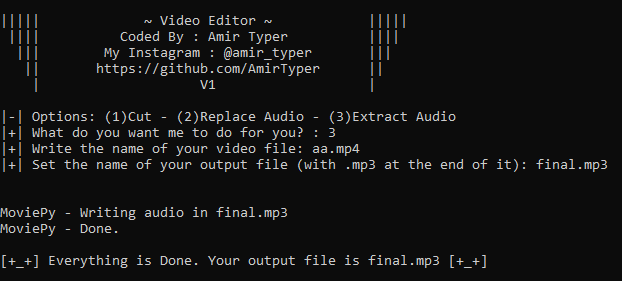

# Video-Editor V1
<b> A simple video editor written in python.</b>
 
 
Enjoy and let me know what you want to see in V2.
 
 

 

# How to use:
<pre><code>
git clone https://github.com/AmirTyper/Video-Editor/
cd Video-Editor
pip install -r requirements.txt
python Editor.py
</code></pre>

# Coded by: AmirTyper
<pre><code>
Developer's Telegram: <a href="https://t.me/Mr_Amir_Typer">Mr_Amir_Typer</a>
Developer's Instagram: <a href="https://instagram.com/amir_typer">amir_typer</a>
Developer's Twitter: <a href="https://twitter.com/AmirTyper">AmirTyper</a>
My Website: <a href="https://amirtyper.ir">amirtyper.ir</a>
</code></pre>
